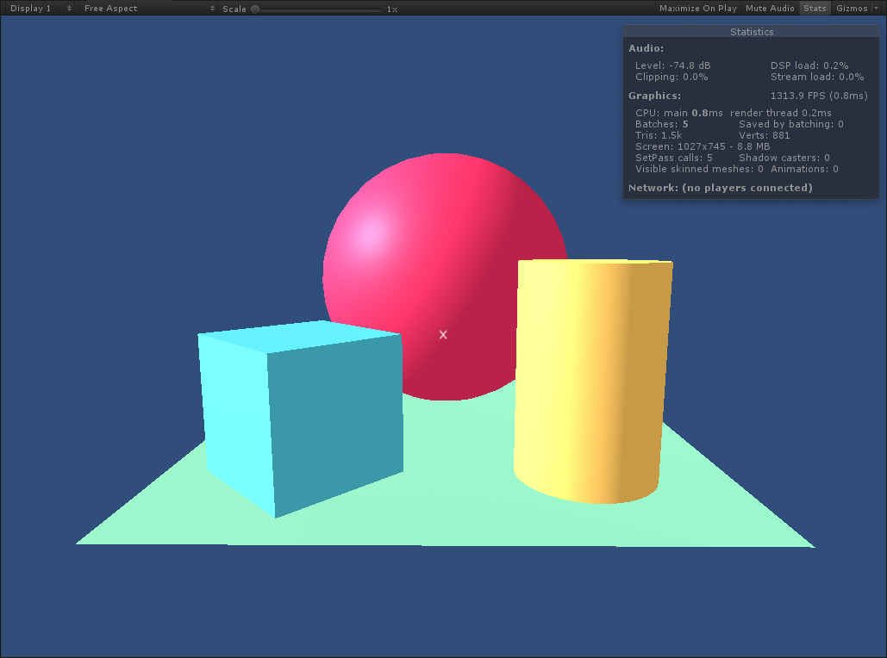

# A-Frame as MRE

This package loads an [A-Frame](https://aframe.io/) scene as a
[Mixed Reality Extension](https://github.com/Microsoft/mixed-reality-extension-sdk).

## Usage

1. Install this adapter: `npm install -g @microsoft/aframe-as-mre`
2. Start the MRE server and point it at the desired A-Frame app (URL or local file):
	1. By CLI argument: `aframe-as-mre https://aframe.io/aframe/examples/animation/aframe-logo/?ui=false`
	2. By environment variable: `AFRAME_URL=/www-content aframe-as-mre`
	3. By app argument: `ws://mres.altvr.com/aframe/?url=test.html`